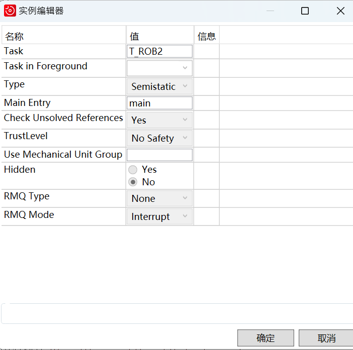

# Control for ABB GOFA Collaboration Robot
---

See examples in the `examples` folder.

## Tutorial
1. Download ABB Robot Studio
2. Add a Task
   1. Goto Controller page 
   2. Goto Configuartion-controller -task
   3. Add a task (Set the task as semistatic to autostart)
      
   4. Restart controller to put the settings into effect
3. Copy `SERVER.mod`under `.\RAPID\SERVER.mod` to task `T_ROB1`
4. Copy `SEC_SERVER.mod` under `.\RAPID\SEC_SERVER.mod` to task `T_ROB2`
5. In the FlexPendant, switch to remote mode and turn the motor on. Set pointer to main and run the program.
6. Run examples under `.\examples\`